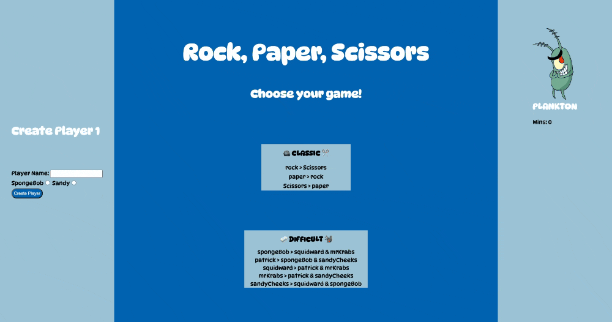

# 🪨 Rock, Paper, Scissors ✂️  

## Abstract:

- I was assigned to create the classic game of `Rock, Paper, Scissors` as a final solo project in Mod 1 at Turing. This game gives the user the ability to play against a computer in a classic version or difficult version. In the classic version, it is the normal rock beats scissors, paper beats rock and scissors beats paper. In the difficult version, I created a SpongeBob version with the rock paper logic. SpongeBob beats Squidward and Mr. Krabs, Patrick beats SpongeBob and Sandy, Squidward beats Patrick and Mr. Krabs, Mr. Krabs beats Patrick and Sandy and Sandy beats Squidward and SpongeBob. 

## Installation Instructions:

1. Select `fork`.
2. Decide where you want to clone this repo in `YOUR` terminal.
3. Select the `Code` button and copy the `SSH` provided.
4. `YOUR` terminal command should look like the line below.
5. `git clone git@github.com:ZTFitru/Rock-Paper-Scissors.git`
6. Move into the directory using `cd [dir_name]`.
7. If using `Visual Studio Code` use the `code .` command in your terminal to run it.
8. View the project in the browser by running open index.html in your terminal.
9. If you just want to `Clone` skip steps 1 & 2.

## Preview of App:

## Context:

- This assignment was given to me on week 6 of attending `Turing` in Mod 1. The assignment was to showcase my understanding of the lessons I’ve learned up to this point. Using what my instructors taught me in Mod1, I was able to create a game anyone can play. 

## Contributors:

[Zelalem Fitru](https://github.com/ZTFitru)

## Learning Goals:

- Demonstrate my understanding of JavaScript.
- Difference between data model and data displayed on the DOM.
- Create my own version of the game on my own.

## Wins + Challenges:

- wins

    - I had fun figuring out how to display my version of difficult setting. 
    - Reducing the code I created the first time, eliminating many nested ifs.
    - Showing my progress to my friends. 

- Challenges

    - I was moving codes around and forgetting to comment them out made it tough to see the results I wanted to see, but after looking at my code, I understood what needs to stay and what needs to just get deleted. 
    - Displaying the change game button gave me a challenge at first. I wanted the user to see the button only when they were playing one of the version and be hidden when they were at the home page. It took me a few tries before I figured out I needed to call the event listeners I created for the game to allow the user to select the version they wanted to play. 

##

 

 

 

 

 

 
